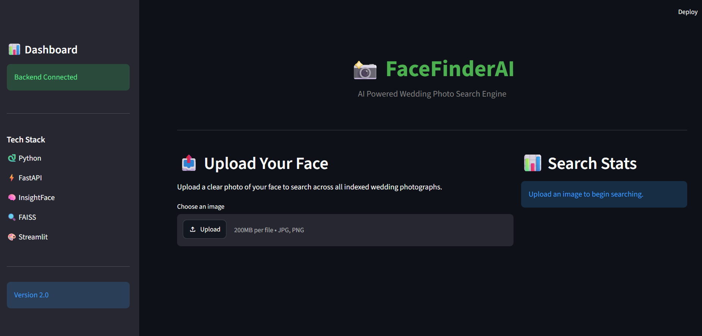
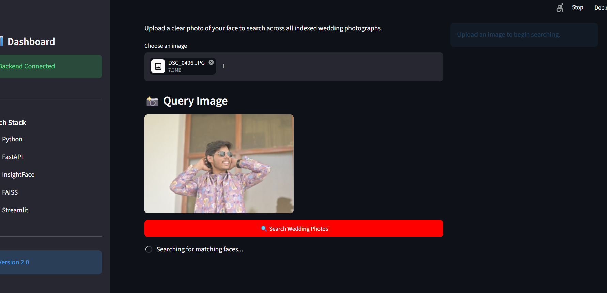
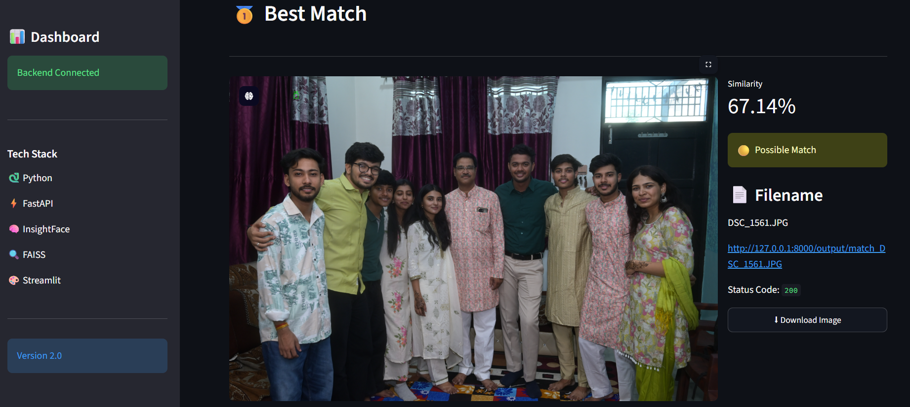

<p align="center">
  
</p>

<h1 align="center"># 📸 FaceFinderAI
### AI-Powered Face Retrieval System</h1>

<p align="center">
An AI-powered face retrieval system for instantly finding people across large event photo collections using InsightFace and FAISS.
</p>

<p align="center">


</p>

---

## 📖 Overview

FaceFinderAI is an AI-powered face retrieval system that enables users to search for a person across large collections of event photographs. Instead of manually browsing hundreds or thousands of images, users simply upload a face image, and the system retrieves visually similar faces using deep facial embeddings and vector similarity search.

The project combines **InsightFace** for face detection and embedding generation, **FAISS** for high-speed similarity search, **FastAPI** for backend services, and **Streamlit** for an intuitive web interface, creating a complete end-to-end face search pipeline.

---

# ❓ Why FaceFinderAI?

Large events such as weddings, conferences, concerts, and social gatherings often generate thousands of photographs. Locating every picture of a specific person manually is tedious, time-consuming, and often impractical.

FaceFinderAI was built to solve this problem using modern computer vision techniques. Instead of browsing entire photo collections, users simply upload a face image, and the system automatically retrieves visually similar faces from the indexed dataset.

The project combines deep facial embeddings generated by **InsightFace** with **FAISS vector similarity search**, enabling fast and scalable face retrieval while maintaining high search accuracy.

---

# ✨ Features

- 🔍 Search for a person using a single face image.
- 🧠 AI-powered face detection and 512-dimensional face embeddings using **InsightFace**.
- ⚡ High-speed vector similarity search using **FAISS**.
- 🖼️ Supports indexing large collections of event and wedding photographs.
- 📊 Displays similarity scores for every matched result.
- 🌐 Interactive web interface built with **Streamlit**.
- 🚀 REST API powered by **FastAPI**.
- 📦 Modular architecture for easy extension and future improvements.

---

# 🚀 Demo

### Search Pipeline

1. Upload a face image.

2. FaceFinderAI detects the face and generates a 512-dimensional embedding.

3. FAISS performs high-speed vector similarity search.

4. The system retrieves the most similar faces along with similarity scores.

5. Matching photographs are displayed through the Streamlit interface.

---

# 📸 Screenshots

## 🏠 Home Dashboard

The application dashboard provides a clean interface for uploading a query image and monitoring the search status.

<p align="center">

</p>

---

## 📤 Upload & Search

Users upload a face image, preview it, and start the search with a single click.

<p align="center">

</p>

---

## 🎯 Search Results

The system returns the best matching photographs along with similarity scores and image metadata.

<p align="center">

</p>

---

# 🏗️ System Architecture


---

# 📊 Performance Benchmark

| Metric | Value |
|---------|------:|
| Images Indexed | 145 |
| Faces Indexed | 581 |
| Embedding Dimension | 512 |
| Indexing Time | 560.27 sec |
| Processing Speed | 0.26 images/sec |
| Face Processing Rate | 1.04 faces/sec |
| Similarity Search | FAISS (Top-K) |
| Backend Framework | FastAPI |
| Frontend | Streamlit |


---

# 📁 Project Structure

```text
FaceFinderAI/
│
├── api/                 # FastAPI backend
├── frontend/            # Streamlit application
├── src/                 # Core face recognition modules
│   ├── detector.py
│   ├── embedder.py
│   ├── indexer.py
│   ├── search.py
│   └── utils.py
│
├── embeddings/          # FAISS index and metadata
├── dataset/             # Image datasets
├── assets/              # README images
├── output/              # Search results
└── README.md
```

---

# ⚙️ Installation

### 1. Clone the Repository

```bash
git clone https://github.com/MukulMangal/FaceFinderAI.git
cd FaceFinderAI
```

### 2. Create a Virtual Environment

Windows:

```bash
python -m venv venv
venv\Scripts\activate
```

Linux / macOS:

```bash
python3 -m venv venv
source venv/bin/activate
```

### 3. Install Required Packages

```bash
pip install -r requirements.txt
```

### 4. Verify Installation

```bash
python -c "import insightface, faiss, cv2, streamlit; print('Installation Successful!')"
```

If no errors appear, FaceFinderAI is ready to use.

---

# 🚀 Usage

The complete workflow consists of three simple steps.

## Step 1 — Index the Dataset

Place all event or wedding photographs inside your dataset folder.

Run the indexing script:

```bash
python -m src.indexer
```

This generates:

- `embeddings.npy`
- `metadata.json`
- `faiss.index`

These files are stored inside the **embeddings/** directory and are used for fast similarity search.

---

## Step 2 — Start the Backend

Launch the FastAPI server:

```bash
uvicorn api.main:app --reload
```

The backend will be available at:

```text
http://127.0.0.1:8000
```

---

## Step 3 — Launch the Frontend

Start the Streamlit application:

```bash
streamlit run frontend/app.py
```

Open the displayed URL in your browser, upload a face image, and the application will retrieve the most similar faces from the indexed dataset.
---

# 🛠️ Tech Stack

| Category | Technology |
|----------|------------|
| Programming Language | Python 3.11 |
| Face Detection | InsightFace (Buffalo_L) |
| Face Embedding | InsightFace (512-D Embeddings) |
| Similarity Search | FAISS |
| Backend Framework | FastAPI |
| Frontend Framework | Streamlit |
| Image Processing | OpenCV |
| Numerical Computing | NumPy |
| Deep Learning Runtime | ONNX Runtime |
| Version Control | Git & GitHub |

---

# 📈 Results

The current implementation was evaluated on a subset of a real wedding photo collection containing 145 high-resolution images with 581 detected faces.

| Metric | Result |
|---------|-------:|
| Images Indexed | **145** |
| Faces Indexed | **581** |
| Face Embedding Size | **512 Dimensions** |
| Search Engine | **FAISS** |
| Face Detection Model | **InsightFace Buffalo_L** |
| Average Indexing Speed | **0.26 Images/sec** |
| Average Face Processing Rate | **1.04 Faces/sec** |

The system successfully retrieves visually similar faces from large event photo collections while displaying similarity scores for every retrieved match.

---

# 🚀 Future Roadmap

FaceFinderAI is continuously evolving. The following features are planned for future releases:

| Status | Feature |
|--------|---------|
| ⏳ | Multi-face query support |
| ⏳ | Incremental indexing without rebuilding the database |
| ⏳ | GPU acceleration for faster indexing |
| ⏳ | Real-time webcam face search |
| ⏳ | Video-based face retrieval |
| ⏳ | Face clustering and grouping |
| ⏳ | Docker support |
| ⏳ | Cloud deployment (AWS / Azure / GCP) |
| ⏳ | User authentication and project management |
| ⏳ | Billion-scale vector database support (Milvus / Pinecone) |

The goal is to transform FaceFinderAI into a scalable, production-ready face retrieval platform capable of handling millions of images efficiently.

---

# 👨‍💻 Author

**Mukul Mangal**

B.Tech Computer Science Engineering (AI & ML)

📧 Passionate about Artificial Intelligence, Computer Vision, and Generative AI.

- GitHub: https://github.com/MukulMangal
- LinkedIn: https://linkedin.com/in/mukulmangal22

If you found this project useful, consider giving it a ⭐ on GitHub.

---

# 📄 License

This project is licensed under the **MIT License**.

Feel free to use, modify, and distribute this project in accordance with the license terms.